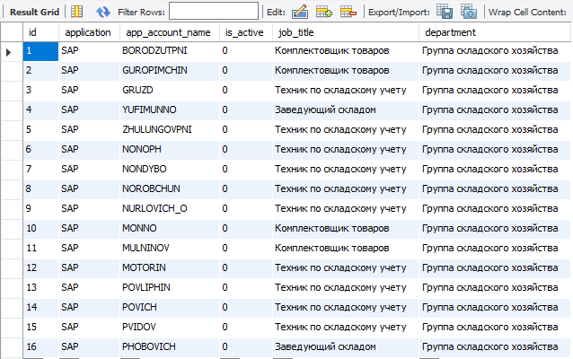

task3

(таблица в базе данных  с данными из файла logins.csv)

(таблица в базе данных  с данными из файла postings.csv)

(данные, считанные из файла logins.csv в коллекцию)

(часть данных, считанных из файла postings.csv в коллекцию)